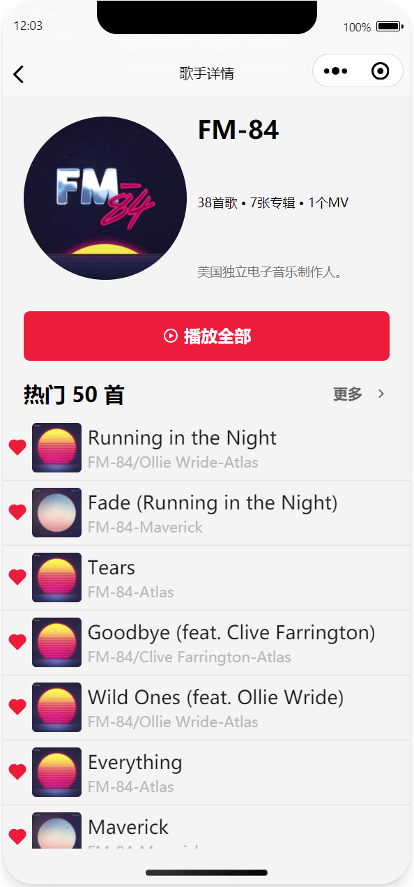
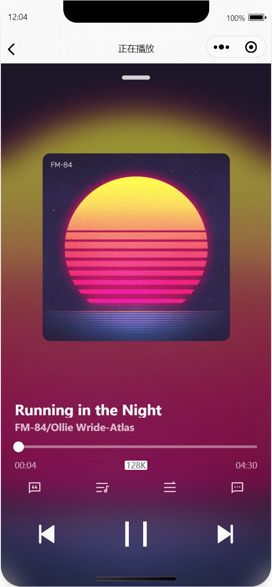

## weapp-simple-cloud-music

taro + react hooks + zustand + tailwindcss

源项目的小程序复刻版本  
源项目地址：[simple-cloud-music](https://github.com/dufu1991/simple-cloud-music)  
接口项目地址：[NeteaseCloudMusicApi](https://github.com/Binaryify/NeteaseCloudMusicApi)

## 部分截图

